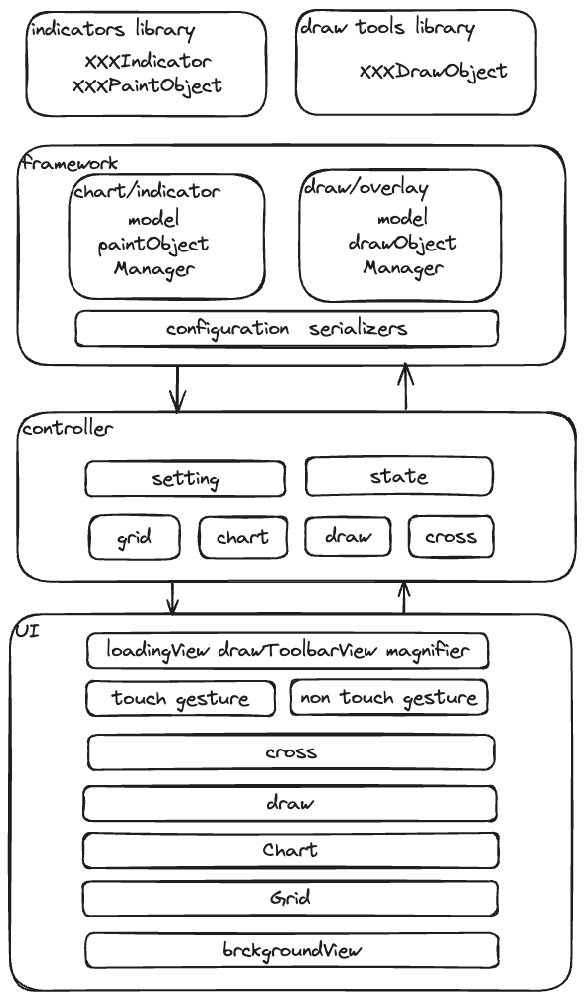

# FlexiKline [](https://pub.dev/packages/flexi_kline)
FlexiKline是一个灵活且高度可定制化的金融Kline图表框架，旨在满足不同用户的需求. 

## Demo

[https://flexikline.github.io](https://flexikline.github.io)

[Android apk](https://github.com/FlexiKline/FlexiKline.github.io/blob/main/mobile/flexi_kline_app.apk)

## 特性

+ 自定义指标(实现指标配置与绘制对象接口).
+ 自定义绘制工具(实现绘制工具接口).
+ 支持全屏/横屏/主副区图表宽高设定与动态调整.
+ 可定制化与持久化样式, 配置, 参数(包括指标/绘制等所有功能).
+ 适配多平台手势操作, 且可定制化操作(惯性平移/缩放位置等).
+ 支持多种平台(Android, iOS, Web, MacOs, Windows, Linux).



## Sample

### 1. Custom FlexiKlineConfiguration

实现IConfiguration接口.
```dart
abstract interface class IStorage {
  Map<String, dynamic>? getConfig(String key);

  Future<bool> setConfig(String key, Map<String, dynamic> value);
}

/// FlexiKline配置接口
abstract interface class IConfiguration implements IStorage {
    /// 当前配置主题
  IFlexiKlineTheme get theme;

  String get configKey;

  /// 生成FlexiKline配置
  FlexiKlineConfig generateFlexiKlineConfig([Map<String, dynamic>? origin]);

  /// 蜡烛指标配置构造器(主区)
  IndicatorBuilder<CandleBaseIndicator> get candleIndicatorBuilder;

  /// 时间指标配置构造器(副区)
  IndicatorBuilder<TimeBaseIndicator> get timeIndicatorBuilder;

  /// 主区指标配置定制
  Map<IIndicatorKey, IndicatorBuilder> get mainIndicatorBuilders;

  /// 副区指标配置定制
  Map<IIndicatorKey, IndicatorBuilder> get subIndicatorBuilders;

  /// 绘制工具定制
  Map<IDrawType, DrawObjectBuilder> get drawObjectBuilders;
}
```
主题配置[IFlexiKlineTheme](https://github.com/FlexiKline/FlexiKline/blob/main/lib/src/framework/configuration.dart#L24)

推荐混入[FlexiKlineThemeConfigurationMixin](https://github.com/FlexiKline/FlexiKline/blob/main/lib/src/config/default_config.dart#L168)实现


### 2. New FlexiKlineController

```dart
final configuration = FlexiKlineConfiguration();
controller = FlexiKlineController(
  configuration: configuration,
  logger: LoggerImpl(
    tag: "FlexiKline",
    debug: kDebugMode,
  ),
  subIndicatorMaxCount: defaultSubIndicatorMaxCount,
  klineDataCacheCapacity: 3,
);
```

### 3. FlexiKlineWidget
```dart
FlexiKlineWidget(
  controller: controller,
  mainBackgroundView: FlexiKlineMarkView(),
  mainForegroundViewBuilder: _buildKlineMainForgroundView,
  onDoubleTap: setFullScreen,
  drawToolbar: FlexiKlineDrawToolbar(
    controller: controller,
  ),
),
```

### 4. UpdateKlineData
```dart
/// 根据[request]切换当前Kline图表数据源[KlineData]; 如发生变更TimerBar时.
flexiKlineController.switchKlineData(request, useCacheFirst: true);

/// 更新[request]指定的数据
flexiKlineController.updateKlineData(request, resp.data);
```

## 自定义指标
```dart
/// MA 移动平均指标线指标配置
class MAIndicator extends PaintObjectIndicator {
  MAIndicator({
    super.zIndex = 0,
    required super.height,
    super.padding = defaultMainIndicatorPadding,
    required this.calcParam,
    required this.tipsPadding,
    required this.lineWidth,
  }) : super(key: maIndicatorKey);

  final List<MaParam> calcParam;
  final EdgeInsets tipsPadding;
  final double lineWidth;

  @override
  PaintObjectBox createPaintObject(IPaintContext context) {
    return MAPaintObject(context: context, indicator: this);
  }

  @override
  Map<String, dynamic> toJson() {
    // TODO: Generate the MA indicator config that you need to save.
    return {"calcParam": calcParam.map((e) => e.toJson()).toList()};
  }
}

/// MA指标绘制对象
class MAPaintObject<T extends MAIndicator> extends PaintObjectBox<T> {

  @override
  void precompute(Range range, {bool reset = false}) {
    // TODO: 针对[range]范围内的数据进行预计算(仅在数据更新时回调)
  }

  @override
  bool shouldPrecompute(MAIndicator oldIndicator) {
    // TODO: (optional) 判断新旧指标配置的变化是否需要执行预计算
  }

  @override
  void didUpdateIndicator(MAIndicator oldIndicator) {
    super.didUpdateIndicator(oldIndicator);
    // TODO: (optional) Check the old and new indicator configurations
  }

  @override
  MinMax? initState(int start, int end) {
    // TODO: 返回[start ~ end)之间的数据范围, 即最大最小的MA指标值.
  }

  @override
  void paintChart(Canvas canvas, Size size) {
    // TODO: 绘制MA移动平均指标线
  }

  @override
  void onCross(Canvas canvas, Offset offset) {
    // TODO: 当十字线移动时回调
  }

  @override
  Size? paintTips(
    Canvas canvas, {
    CandleModel? model,
    Offset? offset,
    Rect? tipsRect, // Tips限定的绘制区域
  }) {
    // TODO: 绘制顶部MA Tips信息
  }
}
```

## 自定义绘制工具
```dart
/// 射线
class RayLineDrawObject extends DrawObject {
  RayLineDrawObject(super.overlay, super.config);

  @override
  bool hitTest(IDrawContext context, Offset position, {bool isMove = false}) {
    // TODO: 判断[position]是否命中当前射线
  }

  @override
  void draw(IDrawContext context, Canvas canvas, Size size) {
    // TODO: 绘制射线
  }
}
```

## 如何配置

### [FlexiKline完整配置.json](./doc/default_flexi_kline_configuration.json)

待更新....


## [TODO](./TODO.md)

## Reference

[Flutter 触控板手势](https://docs.google.com/document/d/1oRvebwjpsC3KlxN1gOYnEdxtNpQDYpPtUFAkmTUe-K8/edit?resourcekey=0-pt4_T7uggSTrsq2gWeGsYQ)

PR 31593：[Mac 触控板手势macOS](https://github.com/flutter/engine/pull/31593)